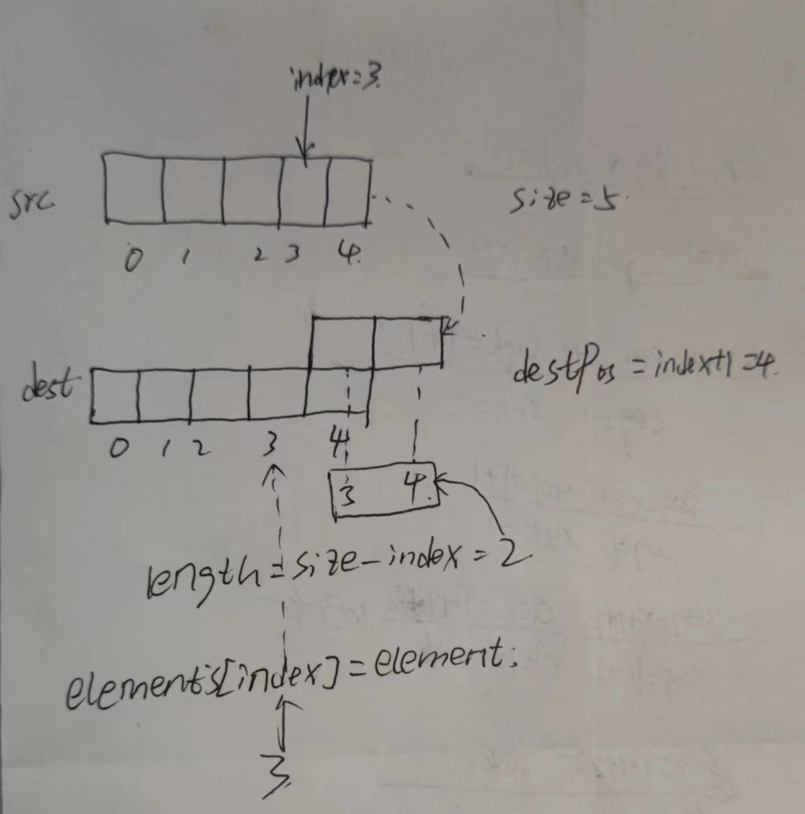

# 线性表
## 数组
<ul>
<li>java.lang.System.arraycopy的分析

```java
public class System {
    /**
     * 
     * @param src    源数组
     * @param srcPos 源数组索引位置
     * @param dest    目标数组
     * @param destPos 目标数组的索引位置
     * @param length  目标数组想要复制的长度  =》 不能超过目标数组的长度
     */
    public static native void arraycopy(Object src, int srcPos,
                                        Object dest, int destPos,
                                        int length);
}
```
arraycopy可以对一个或多个数组拷贝,
在ArrayList中对当前数组elements的拷贝

在java.util.ArrayList<E>中的add(int index, E element);
```System.arraycopy(elementData,index,elementData,index+1,size-index);```


```java
package com.mysite.test;

import org.junit.Test;

/**
 *  test System.arrayCopy(Object src, int srcPos,
                             Object dest, int destPos,
                             int length)
 * 
 */
public class RandomTest {
    @Test
    public void test1(){
        int[] arr1 = new int[]{1,2,3,4,5,6,7,8,9,10};
        int[] arr2 = new int[]{11,12,13,14,15,16,17,18,19,20};
        
        //将arr1作为源数组 arr2作为目标数组
        //2 为原数组的下标，5 为目标数组的下标，
        //3 为从原数组的srcPros下标复制到目标数组的长度
        System.arraycopy(arr1,2,arr2,5,3);

        for (int i = 0; i < arr1.length; i++) {
            if (i != 0) System.out.print(", ");
            System.out.print(arr1[i]);
        }
        System.out.println();
        for (int i = 0; i < arr2.length; i++) {
            if (i != 0) System.out.print(", ");
            System.out.print(arr2[i]);
        }
    }
}
```
<li>java.util.Arrays.copyOf(T[], int)的分析

```java
public class Arrays {
    /**
     * 数组的复制
     * @param original 源数组
     * @param newLength 从源数组复制的长度 从下标0开始复制
     * @return 返回源数组类型的新数组
     * @param <T> 源数组的类型
     */
    public static <T> T[] copyOf(T[] original, int newLength) {
        return (T[]) copyOf(original, newLength, original.getClass());
    }
}
```

```java
public class TestArrayCopy {
    
    @Test
    public void testCopyOf() {
        int[] arr = new int[]{1, 2, 3, 4, 5};
        int[] newArray = Arrays.copyOf(arr, arr.length);
    }
}
```

</ul>
