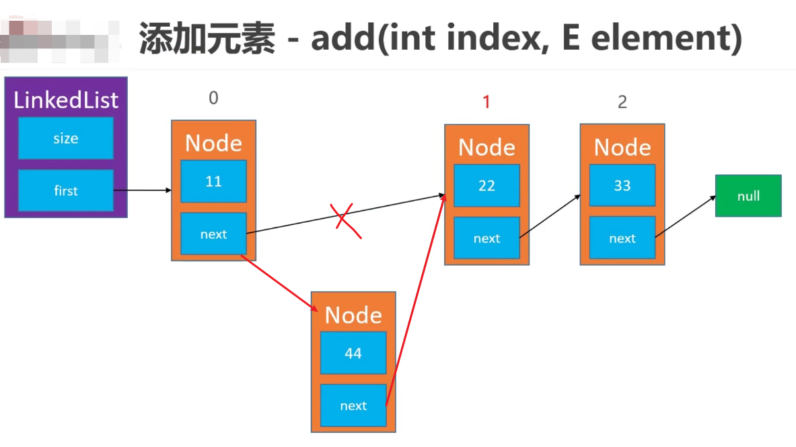

# 线性表
## 链表
<ul>
    <li>添加元素

</ul>
在我设计的链表LinkedList<E>中，add和remove操作的平均时间复杂度为O(n)，
平时说链表和数组的区别是链表的插入和删除的时间复杂度是O(1)，这是针对链表中
插入或删除的那一刻区别的，相比数组，链表不需要挪动元素，只操作一次。但实际上
链表的时间复杂度还是O(n);

在实现ArrayList<E>的扩容和缩容时，要注意扩容倍数、缩容时机的设计，有可能会导致
复杂度震荡。当扩容和缩容的倍数相乘等于1时，会导致
复杂度震荡
