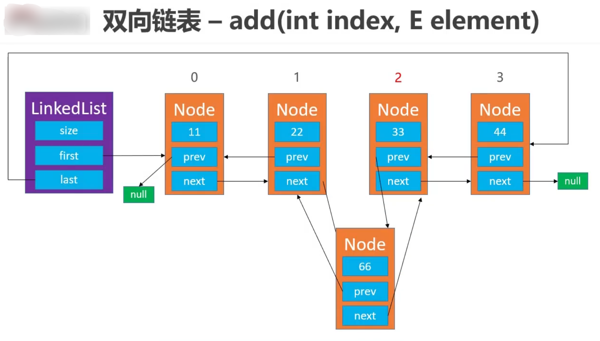
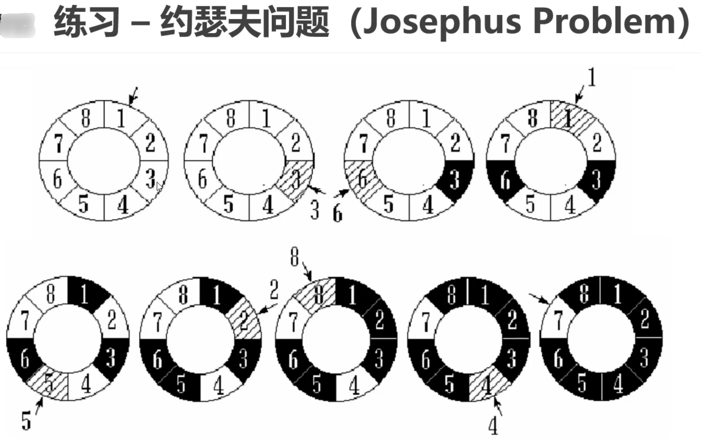

# 线性表
## [双向链表](./main/java/com/mysite/linkedlist/LinkedList.java)
与SingleLinkedList<E>的不同

<ol>
<li>在LinkedList中添加了属性<code>Node< E> last;</code>指向链表的尾节点</li>

<li>在LinkedList的内部类Node中新增了<code>Node< E> prev;</code></li>


```java
private static class Node<E>{
    E element;
    Node<E> next;
    Node<E> prev;   //指向前一个节点
    
    public Node(E element, Node<E> next, Node<E> prev) {
        this.prev = prev;
        this.element = element;
        this.next = next;
    }
}
```
<li>在node方法中根据index查找节点,先判断index在节点中的位置，靠左从头部遍历，
靠右从尾部遍历</li>

<li>添加节点</li>



</ol>
🧐现在有个问题：<p>
Q:<p>在对双向链表的clear操作中，只将first和last节点设为空，能够将链表中的
所有节点都清空吗？这样不会造成循环引用吗？节点之间相互调用，会导致虚拟机不能清空吗？<p>
A:<p>
尽管只是将头节点和尾节点的引用置为 null，链表的节点相互引用，
但当这两个节点不再与其他对象相互连接时，整个链表的节点会变得不可访问。
在垃圾回收器运行时，不可访问的节点会被标记并最终被清除，释放相应的内存。


### [双向循环链表](./main/java/com/mysite/linkedlist/circle/CircleLinkedList.java) 

[约瑟夫问题](./main/java/com/mysite/linkedlist/excise/CircleLinkedList.java) 

采用双向循环链表解决此问题
增设1个成员变量、3个方法
<ul>
    <li>current：用于指向某个节点</li>
    <li>void reset()：让current指向头节点first</li>
    <li>E next()：让current往后走一步，也就是current = current.next</li>
    <li>E remove()：删除current指向的节点，删除成功后让current指向下一个节点</li>
</ul>


