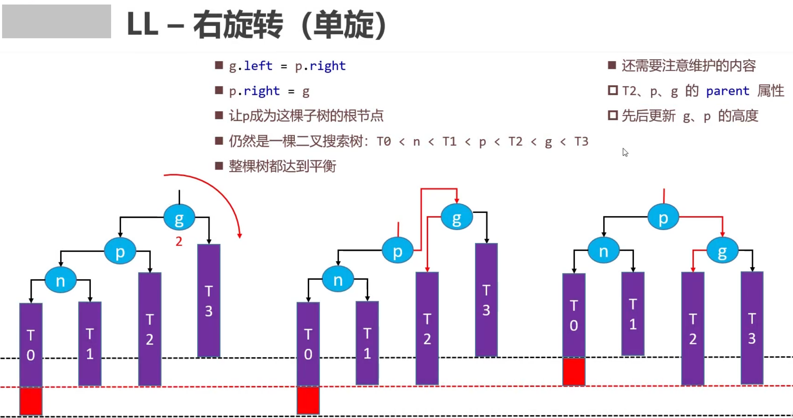
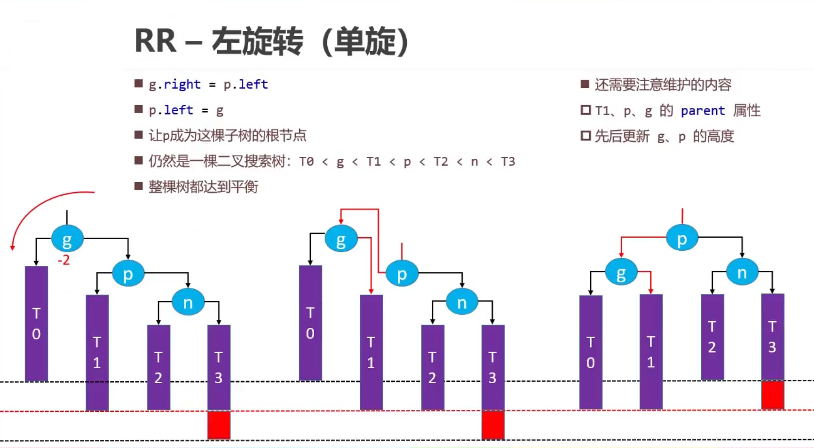
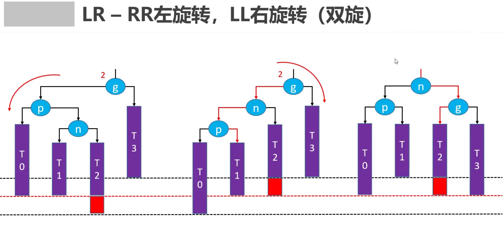
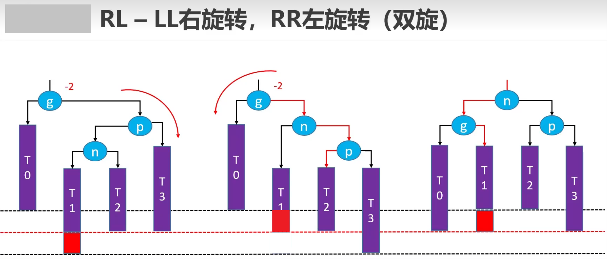

## AVL树
平衡因子(Balance Factor): 某节点的左右子树的高度差 
<ul>
AVL树的特点：
<li>每个节点的平衡因子只可能是1、0、-1（绝对值 <= 1,如果超过1，称之为"失衡"）</li>
<li>每个节点的左右子树高度差不超过 1</li>
<li>搜索、添加、删除的时间复杂度是 O(logn)</li>
</ul>

> 添加导致的失衡： 
> 最坏情况：可能会导致所有祖先节点都失衡。
> 父节点、非祖先节点，都不可能失衡

