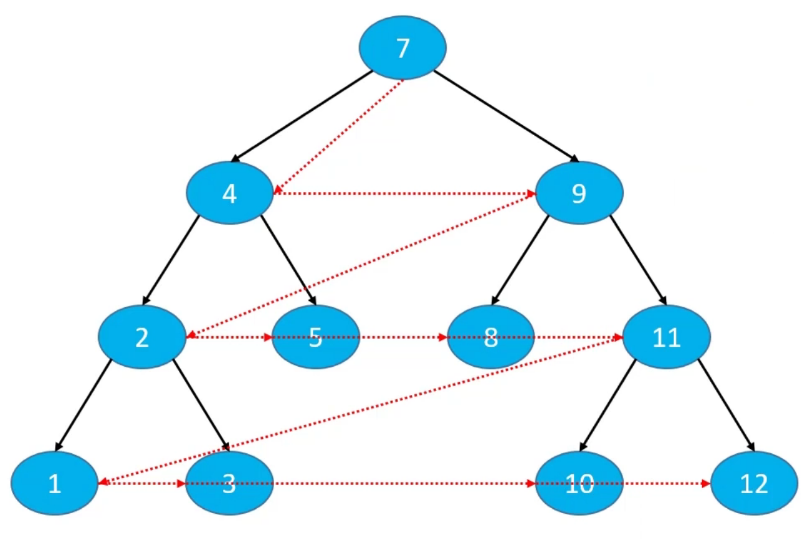

## [二叉搜索树(Binary Search Tree)](./main/java/com/mysite/binarysearchtree/BST.java)
### 二叉搜索树的接口设计

<ul>
<li>int size();// 元素的数量</li>
<li>boolean isEmpty()// 是否为空</li>
<li>void clear() // 清空所有元素</li>
<li>void add(E element) // 添加元素</li>
<li>void remove(E element)// 删除元素</li>
<li>boolean contains(E element)// 是否包含某元素</li>
</ul>

> 注意：二叉搜索是没有索引的

这里测试二叉搜索树的结果，引入了M了个J大佬的代码[printer](./main/java/com/mysite/printer)

> <a href="httpse://github.com/CoderMJLee/BinaryTrees">MJLee大佬</a>

### 二叉树的遍历
根据节点的访问顺序的不同，二叉树的常见遍历方式有4种:
<ul>
<li>前序遍历(Preorder Traversal)</li>
<li>中序遍历(Inorder Traversal)</li>
<li>后序遍历(Postorder Traversal)</li>
<li>层序遍历(Level Order Traversal)</li>
</ul>

#### 前序遍历（根节点在最前）
访问顺序： 
根节点、前序遍历左子树、前序遍历右子树

#### 中序遍历（根节点在中间）
访问顺序： 
中序遍历左子树、根节点、中序遍历右子树
> 如果是一棵二叉搜索树，那么中序遍历就是有序的，升序或降序

#### 后序遍历（根节点在最后）
访问顺序： 
后序遍历左子树、后序遍历右子树、根节点

#### 层序遍历
访问顺序： 
从上到下、从左到右依次访问每一个节点

> 实现思路使用队列
> 1. 将根节点入队
> 2. 循环执行以下操作，直到队列为空
> 
> 将队头节点A出队，进行访问。将A的左子节点入队，将A的右子节点入队

前驱节点：中序遍历时的前一个节点

