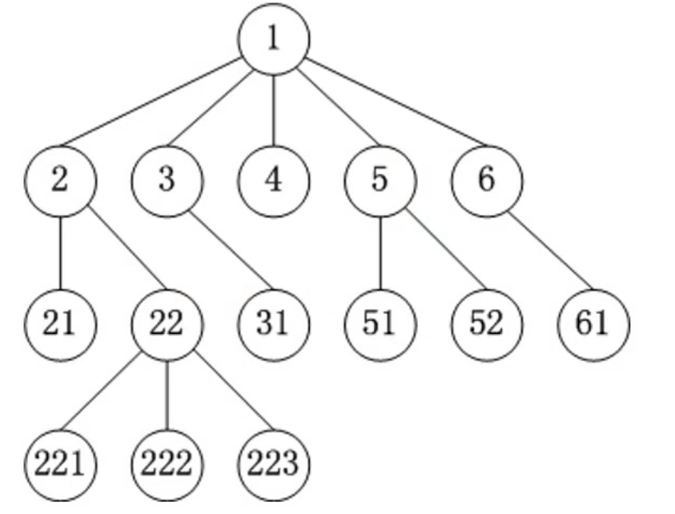
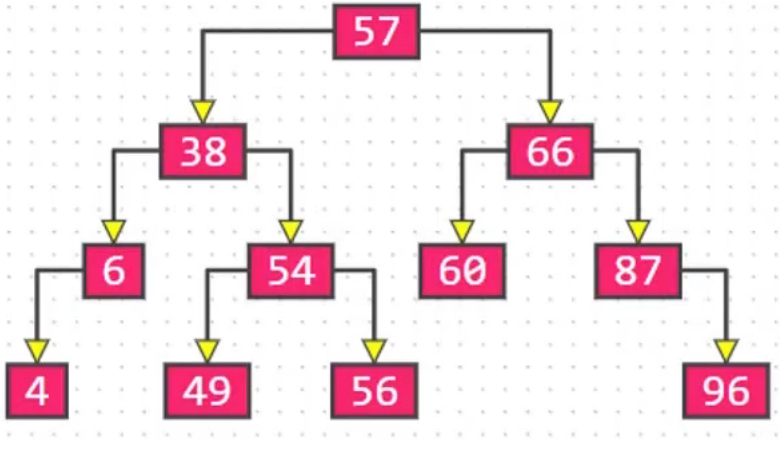
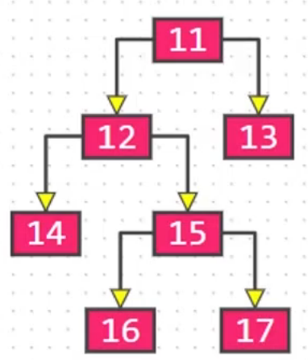
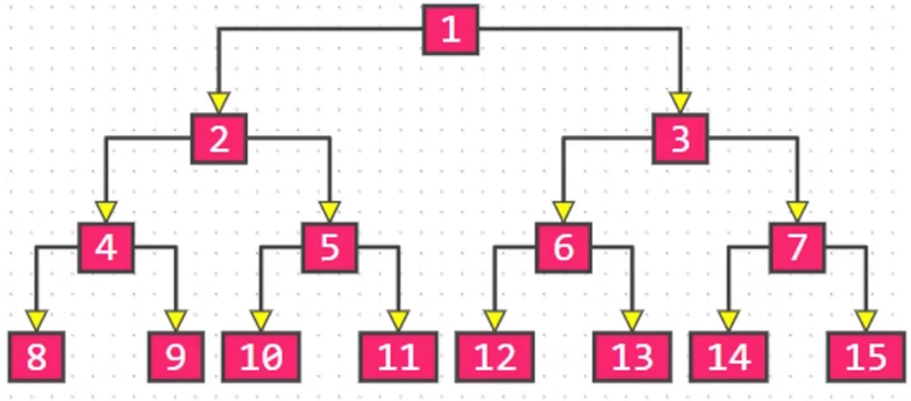
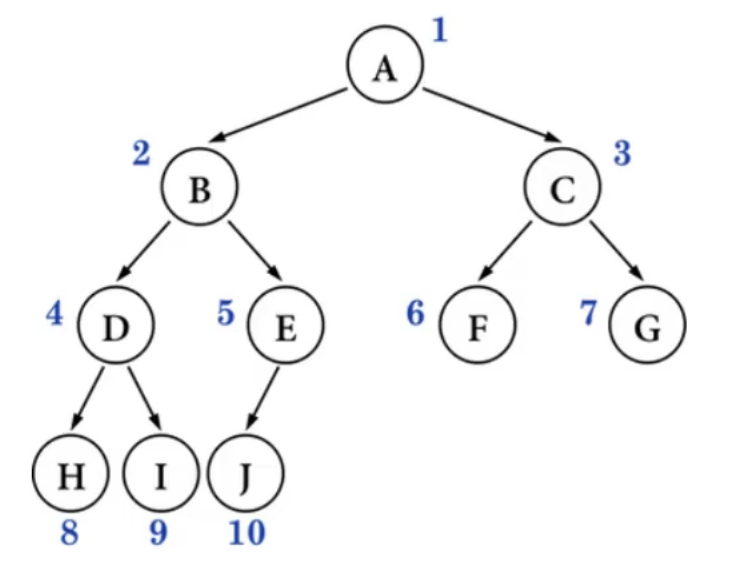
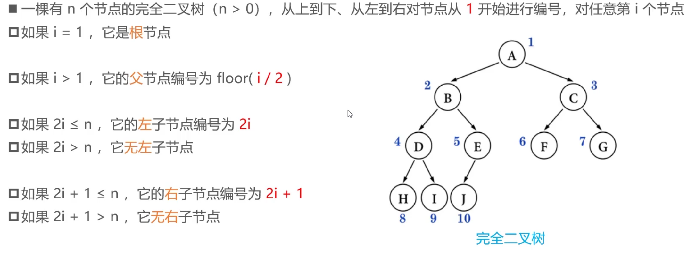
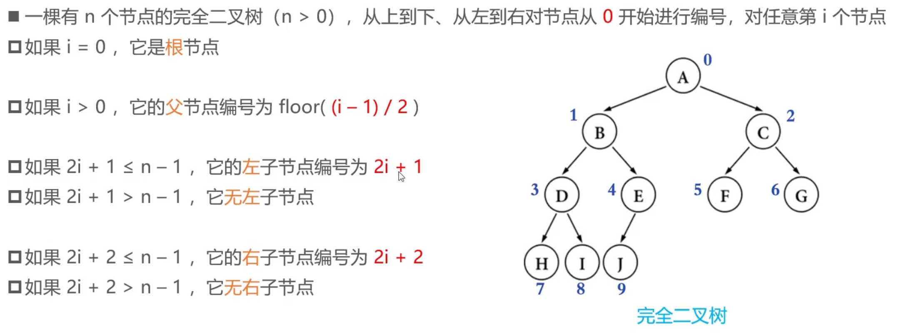

# 树形结构
## 树(Tree)
树(Tree)的基本概念:

<ul>
<li>节点、根节点、父节点、子节点、兄弟节点</li>
<li>一棵树可以没有任何节点，称为空树</li>
<li>一棵树可以只有1个节点，也就是只有根节点</li>
<li>子树、左子树、右子树</li>

<li>节点的度(degree)：子树的个数</li>
<li>树的度：所有节点度中的最大值</li>
<li>叶子节点(leaf)：度为0的节点</li>
<li>非叶子节点(leaf)：度不为0的节点</li>

<li>层数(level)：根节点在第1层，根节点的子节点在第2层</li>
<li>节点的深度(depth)：从根节点到当前节点的唯一路径上的节点总数</li>
<li>节点的高度(height)：从当前节点到最远叶子节点的路径上的节点总数</li>
<li>树的深度：所有节点深度中的最大值</li>
<li>树的高度：所有节点高度中的最大值</li>
<li>树的高度一般等于树的深度</li>

<li>有序树：树中任意节点的子节点之间有顺序关系</li>
<li>无序树：树中任意节点的子节点之间没有顺序关系</li>
<li>森林：由m (m >= 0) 棵互不相交的树组成的集合</li>

</ul>

## 二叉树(Binary Tree)

二叉树的特点：
<ul>
<li>每个节点的度最大为2 (最多拥有2棵子树)</li>
<li>左子树和右子树是有顺序的</li>
<li>即使某节点只有一棵子树，也要区分左右子树</li>
</ul>
二叉树的性质：
<ul>
<li>非空二叉树的第i层，最多有2(i-1)个节点（i >= 1）</li>
<li>在高度为h的二叉树上最多有2h - 1个节点（h >= 1）</li>
<li>对于任何一棵非空二叉树，如果叶子结点的个数为n0，度为2的节点个数为n2，则有：n0 = n2 + 1</li>
<li>假设度为1的节点个数为n1，那么二叉树的节点总数n = n0 + n1 + n2</li>
<li>二叉树的边数T = n1 + 2 * n2 = n - 1 = n0 + n1 + n2 - 1</li>
</ul>

## 真二叉树(Proper Binary Tree)
> 又称完满二叉树

真二叉树：所有节点的度都要么为0，要么为2
 
## 满二叉树(Full Binary Tree)

> 又称完美二叉树

满二叉树：所有节点的度都要么为0，要么为2。且所有的叶子节点都在最后一层

<ul>
<li>在同样高度的二叉树中，满二叉树的叶子节点数量最多、总节点数量最多</li>
<li>满二叉树一定是真二叉树，真二叉树不一定是满二叉树</li>
</ul>
假设满二叉树的高度为h（h >= 1），那么
第i层的节点数量：2(i-1)
叶子节点数量：2(h-1)

## 完全二叉树(Complete Binary Tree)
完全二叉树：叶子节点只会出现在最后2层，且最后1层的叶子节点都靠左对齐

<ul>
完全二叉树从根节点至倒数第2层是一棵满二叉树 
满二叉树一定是完全二叉树，完全二叉树不一定是满二叉树
</ul>
完全二叉树的性质：
<ul>
<li>度为1的节点只有左子树</li>
<li>度为 1 的节点只有左子树度为 1 的节点要么是 1 个，要么是 0个</li>
<li>同样节点数量的二叉树，完全二叉树的高度最小</li>
<li>假设完全二叉树的高度为h（h ≥ 1），那么</li>
<li>至少有 2(h-1) 个节点</li>
<li>最多有 2(h-1) 个节点 => 满二叉树</li>
<li>总结点数量为n</li>
    <ul>
    <li>2(h-1) ≤ n < 2h</li>
    <li>h-1 ≤ log2n < h</li>
    <li>h = floor(log2n) + 1</li>
    </ul>

</ul>
面试题：

已知完全二叉树的总结点，求叶子节点的总数 
如果总结点是偶数，叶子节点n0 =(n) / 2 
如果总结点是奇数，叶子节点n0 =(n + 1) / 2 
避免取余: n0 = floor((n + 1) / 2) 或 n0 = celling(n / 2)  //程序是默认 向下取整 =》n0 = (n + 1) / 2 
叶子节点：n0 = (n + 1) >> 1; 
非叶子节点：n1 + n2 = (n) >> 1; 

