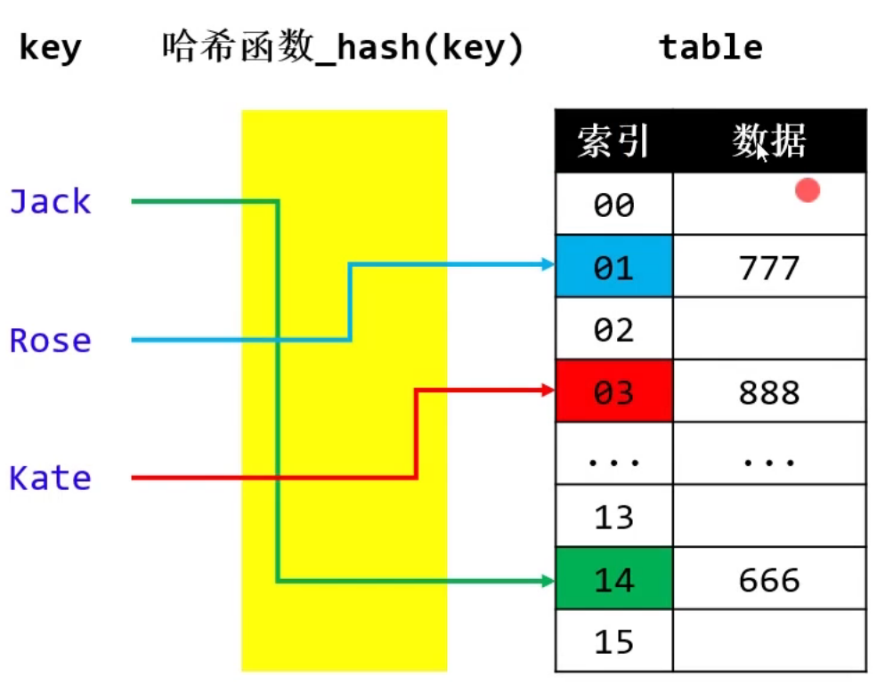
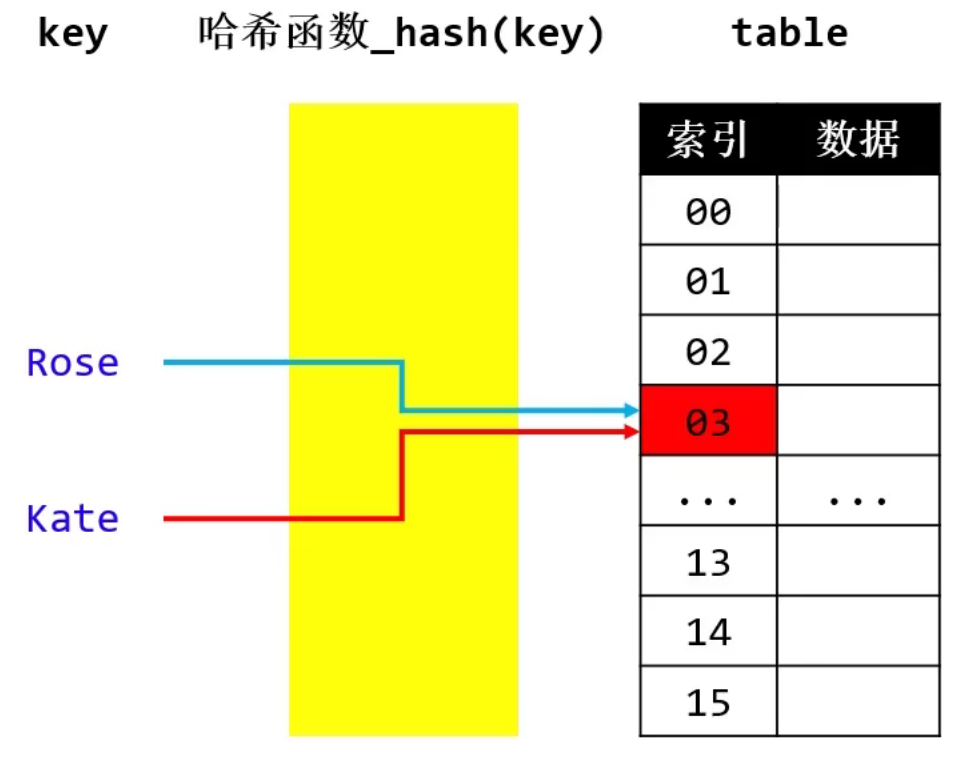
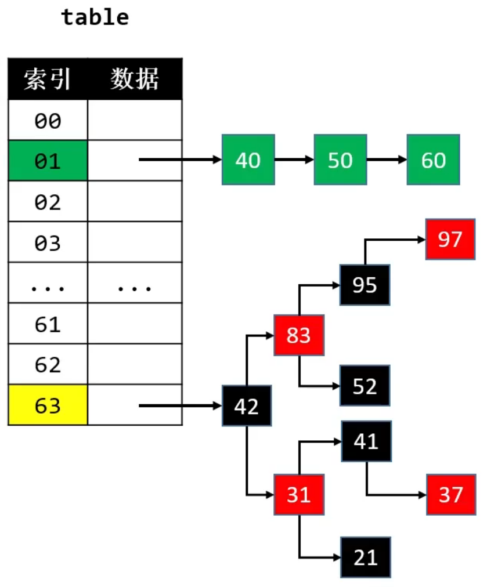
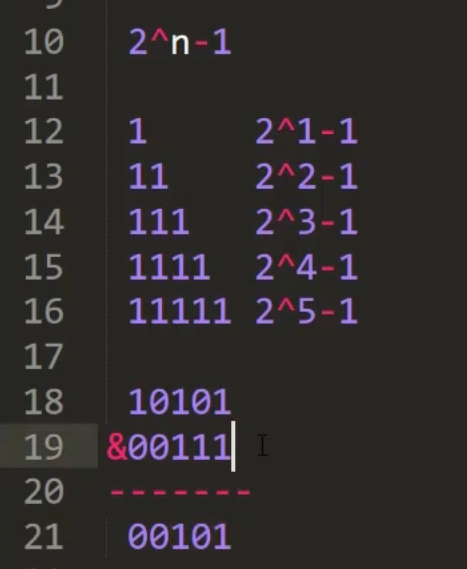
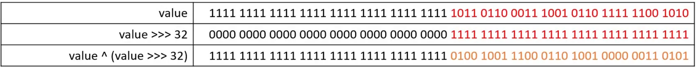

### 哈希表(HashTable)
哈希表也叫做散列表(hash有"剁碎”的意思)

添加、搜索、删除的流程都是类似的
1.index【O(1)】<br>
2.根据index操作定位数组元素【0(1)】<p>
哈希表是【空间换时间】的典型应用<br>
哈希函数，也叫做散列函数<br>
哈希表内部的数组元素,很多地方也叫Bucket(桶),整个数组叫Buckets或者Bucket Array<br>

### 哈希冲突(Hash Collision)
> 哈希冲突也叫做哈希碰撞


2个不同的key，经过哈希函数计算出相同的结果<br>
key1 ≠ key2 , hash(key1) = hash(key2)<br>

<ol><b>解决哈希冲突的常见方法</b>
<li>开放定址法(Open Addressing)</li>
按照一定规则向其他地址探测，直到遇到空桶
<li>再哈希法(Re-Hashing)</li>
设计多个哈希函数
<li>链地址法(Separate Chaining)</li>
比如通过链表将同一index的元素串起来
</ol>

JDK1.8的哈希冲突解决方案：<br>
在添加元素时，可能会由单向链表转为红黑树来存储元素，<br>
当哈希表容量 ≥ 64且单向链表的节点数量大于8时<br>
当红黑树节点数量少到一定程度时，有会转为单向链表<br>
JDK1.8中的哈希表使用链表+红黑树解决哈希冲突


### 哈希函数
哈希表中的哈希函数的实现步骤大概如下：
1. 先生成key的哈希值（必须是整数）
2. 再让key的哈希值跟数组的大小进行相关运算，生成一个索引值
```java
public int hash(Object key){
    return hash_code(key) % table.length;
}
```
为了提高效率，可以使用 & 位运算取代 % 运算【前提：将数组的长度设计为2的幂（2<sup>n</sup>）】<br>

```java
public int hash(Object key){
    return hash_code(key) & table.length - 1;
}
```
良好的哈希函数：<br>
让哈希值更加均匀分布 -> 减少哈希冲突次数 -> 提升哈希表的性能
### 如何生成key的哈希值
key 的常见种类可能有
整数、浮点数、字符串、自定义对象<br>
不同种类的key，哈希值的生成方式不一样，但目标是一致的<br>
✔尽量让每个key的哈希值是唯一的<br>
✔尽量让key的所有信息参与运算<br>
在Java中，HashMap的key必须实现hashCode、equals方法，也允许key为null
- 整数<br>
    整数值当作哈希值<br>
    比如10的哈希值就是10<br>
- 浮点数<br>
  将存储的二进制格式转为整数值<br>
- Long和Double的哈希值
    ```java
    public static int hashCode(long value){
        return (int) (value ^ (value) >>> 32);    
    }
    ```
    ```java
    public static int hashCode(double value){
        long bits = doubleToLongBits(value);
        return (int) (value ^ (bits) >>> 32);
    }
    ```
     `>>>`和`^` 的作用是？<br>
    高32bit和低32bit混合计算出32bit的哈希值<br>
    充分利用所有信息计算出哈希值<br>
    
- 字符串的哈希值<br>
    字符串是由若干个字符组成的<br>
    例如字符串jack的哈希值可以表示为`j * n^3 + a * n^2 + c * n^1 + k * n^0`，
    等价于 `[(j * n + a) * n + c] * n + k`<br>
    在JDK中，乘数n 为31，为什么使用31？<br>
    31 是一个奇素数，JVM会将 `31 * i` 优化成`(i<<5)-i`<br>
- 自定义对象的哈希值<br>
    重写hashCode方法,默认通过内存地址计算得到hashCode<br>
<p>🤔思考：<br>
1. 哈希值太大，整型溢出怎么办？<br>
    不做任何处理。<br>
2. 不重写hashCode方法会怎么样？<br>
   会使用Object默认的hashCode实现-》底层是使用内存中的位置作为hashCode<br>


