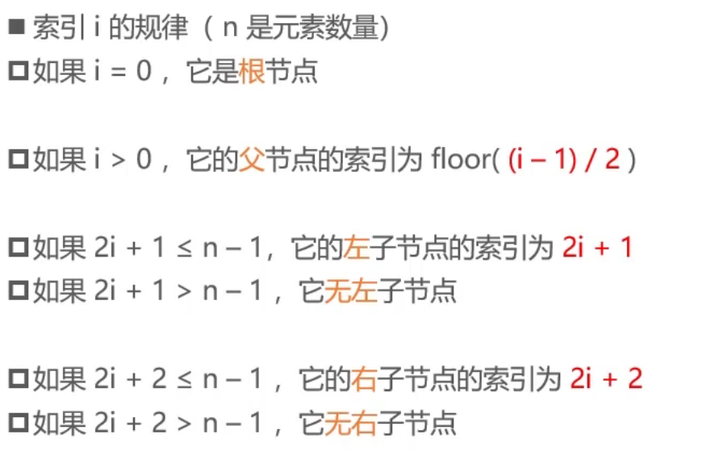
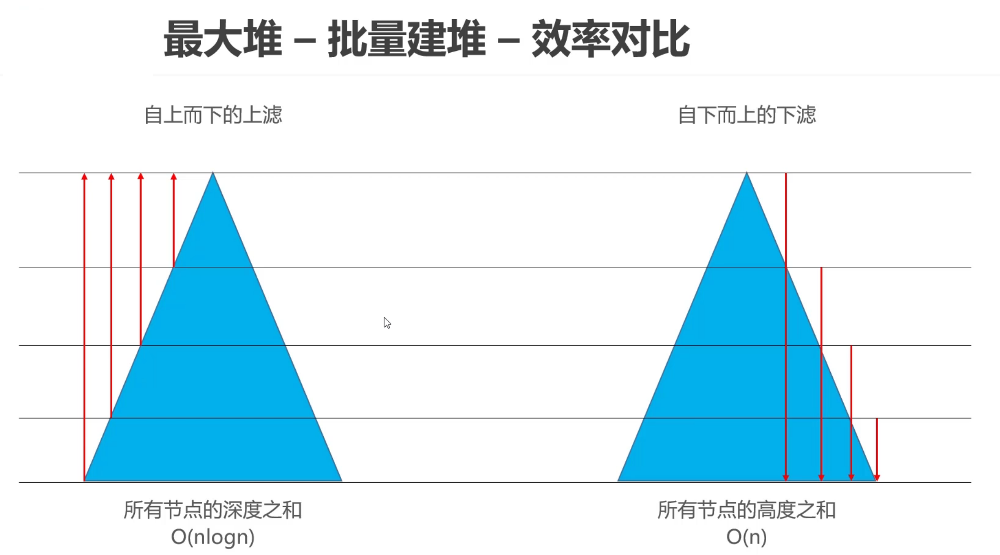

Top K问题  
从海量数据中找出前K个数据  
比如:从100万个整数中找出最大的100个整数  
TopK问题的解法之一：可以用数据结构"堆"来解决  
### 堆(Heap)  
堆(Heap)也是一种梳状的数据结构(不要跟内存模型中的“堆空间”混淆),常见的堆实现有  
二叉堆(Binary Heap，完全二叉堆)  
多叉堆(D-heap, D-ary Heap)  
索引堆(Index Heap)  
二项堆（Binomial Heap)  
斐波那契堆(Fibonacci Heap)  
左倾堆(Leftist Heap，左式堆)  
斜堆(Skew Heap)  

堆的一个重要性质: 任意节点的值总是≥(≤)子节点的值  
如果任意节点的值总是 ≥ 子节点的值，称为: 最大堆、大根堆、大顶堆    

堆中的元素必须具备可比较性
#### 接口设计
int size(); // 元素的数量  
boolean isEmpty(); // 是否为空  
void clear();//清空  
void add(E element); // 添加元素  
E get();// 获得堆顶元素  
E remove(); //删除堆顶元素  
E replace(E element); //删除堆顶元素,同时插入新的元素

### 二叉堆(Binary Heap)
二叉堆的逻辑结构就是一棵完全二叉树，所以也叫完全二叉堆  
鉴于完全二叉树的一些特性,二叉堆的底层(物理结构)一般用数组实现即可  

 

最大堆-批量建堆-效率对比  

🤔TopK问题  
从 n 个整数中，找出最大的前 k 个数（k 远远小于 n）  
如果使用排序算法进行全排序，需要 O(nlogn) 的时间复杂度  
如果使用二叉堆来解决，可以使用 O(nlogk) 的时间复杂度来解决
