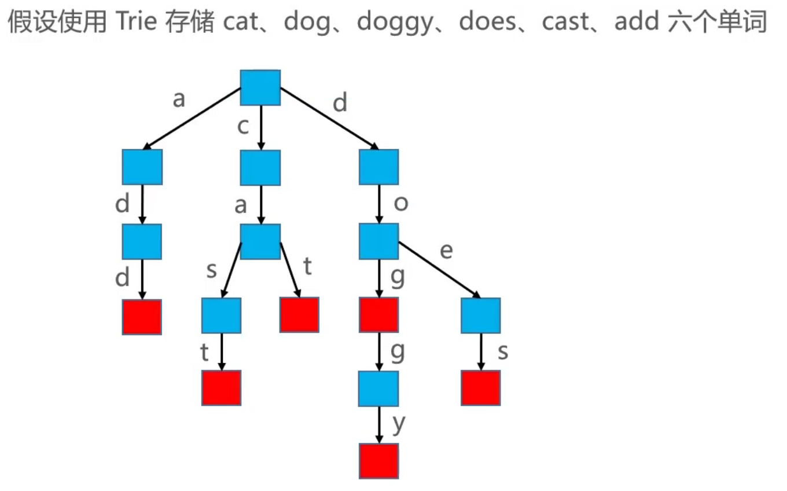

### Trie
>也称字典树、前缀树(Prefix Tree)、单词查找树

Trie 搜索字符串的效率主要跟字符串的长度有关  

### 接口设计
int size();  
boolean isEmpty ();  
void clear ();  
boolean contains(String str);  
void add(String str, V value);  
void remove(String str);  
boolean starsWith(String prefix);  

Trie的优点:搜索前缀的效率主要跟前缀的长度有关  
Trie的缺点:需要耗费大量内存
